# ruby-ruviz

Ruby bindings for the Rust [`ruviz`](https://github.com/Ameyanagi/ruviz) plotting
library, built with [Magnus](https://github.com/matsadler/magnus) + `rb-sys`.

The binding is deliberately **thin**: ruviz performs all layout, scaling and
rendering; Ruby just offers an idiomatic fluent API and hands numeric data to
Rust with as little copying as possible.

```ruby
require "ruviz"

Ruviz.plot
  .size_px(760, 420)
  .title("Decay Rates")
  .xlabel("time")
  .ylabel("intensity")
  .line(x, y, label: "fast decay", color: "#2563eb", width: 2.0)
  .yscale(:log)
  .grid(true)
  .legend(:upper_right)
  .save("decay.png")   # .png / .svg / .pdf by extension
```

## Gallery

<table>
  <tr>
    <td align="center">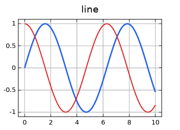<br>line</td>
    <td align="center">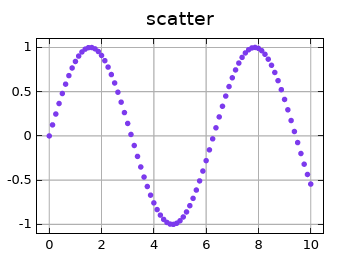<br>scatter</td>
    <td align="center">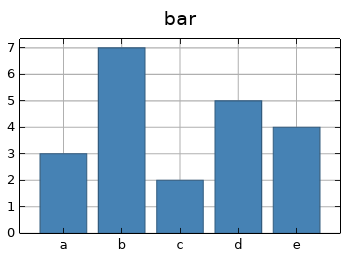<br>bar</td>
  </tr>
  <tr>
    <td align="center">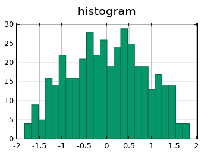<br>histogram</td>
    <td align="center">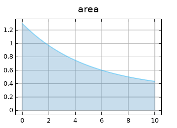<br>area</td>
    <td align="center">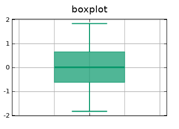<br>boxplot</td>
  </tr>
  <tr>
    <td align="center">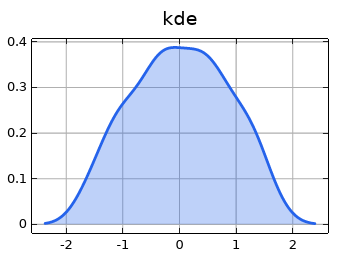<br>kde</td>
    <td align="center">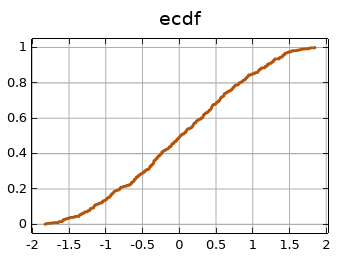<br>ecdf</td>
    <td align="center">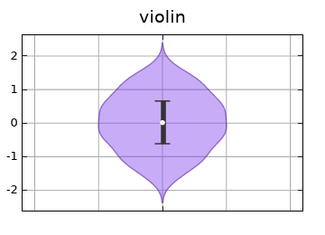<br>violin</td>
  </tr>
  <tr>
    <td align="center">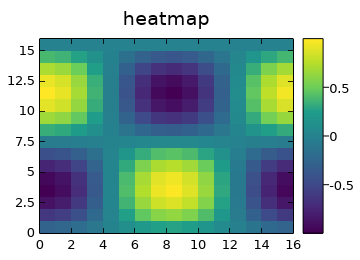<br>heatmap</td>
    <td align="center">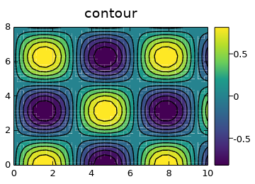<br>contour</td>
    <td align="center">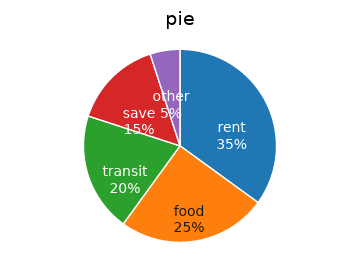<br>pie</td>
  </tr>
  <tr>
    <td align="center">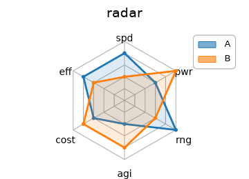<br>radar</td>
    <td align="center">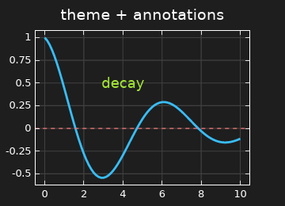<br>theme + annotations</td>
    <td></td>
  </tr>
</table>

Regenerate with `bundle exec ruby examples/gallery.rb`.

## Data input

Numeric data can come from (in order of preference, to avoid materializing Ruby
objects for large datasets):

1. `Numo::NArray` — read through its native buffer (no Ruby Array)
2. Polars `Series` / DataFrame column — via the Polars binding's native `to_numo`
3. Ruby `Array`

2-D inputs (heatmap, contour) accept an Array of Arrays or a 2-D `Numo::NArray`.

## Reference

### Series

| method | data |
|---|---|
| `line(x, y, label:, color:, width:)` | two 1-D vectors |
| `scatter(x, y, label:, color:, marker:, marker_size:, alpha:)` | two 1-D vectors |
| `bar(categories, values, label:, color:, alpha:)` | labels + 1-D values |
| `histogram(data, bins:, label:, color:, alpha:)` | 1-D sample |
| `area(x, y, baseline:, label:, color:, width:, alpha:)` | two 1-D vectors |
| `boxplot(data, label:, color:, alpha:)` | 1-D sample |
| `kde(data, label:, color:, alpha:)` | 1-D sample |
| `ecdf(data, label:, color:, alpha:)` | 1-D sample |
| `violin(data, label:, color:, alpha:)` | 1-D sample |
| `heatmap(data)` | 2-D matrix |
| `contour(x, y, z, levels:, filled:)` | 1-D x/y + flat row-major z (nx*ny) |
| `pie(values, labels:, donut:)` | 1-D slice values |
| `radar(labels, series)` | axis labels + one or more series |

### Figure / axes

`size_px(w, h)` · `title(s)` · `xlabel(s)` · `ylabel(s)` ·
`xscale(:linear \| :log \| :symlog)` · `yscale(...)` · `xlim(min, max)` ·
`ylim(min, max)` · `grid(bool)` · `legend(:best \| :upper_right \| …)` ·
`theme(:light \| :dark \| :publication \| :minimal \| :seaborn \| :presentation)`

### Annotations

`hline(y, color:, width:, style:)` · `vline(x, …)` ·
`annotate_text(x, y, text, color:, size:)` ·
`rect(x, y, width, height, color:, line_width:)`

Line styles: `:solid :dashed :dotted :dash_dot :dash_dot_dot`.
Markers: `:circle :square :triangle :triangle_down :diamond :plus :cross :star`
and their `_open` variants. Colors accept CSS names and `#rrggbb` hex.

### Output

`save(path)` chooses PNG / SVG / PDF by file extension.

## Errors

Invalid arguments raise `ArgumentError`; ruviz render/IO failures raise
`Ruviz::Error`. Rust panics never cross into Ruby.

## Development

```sh
bundle install
bundle exec rake compile
bundle exec rake test
```

## License

MIT
